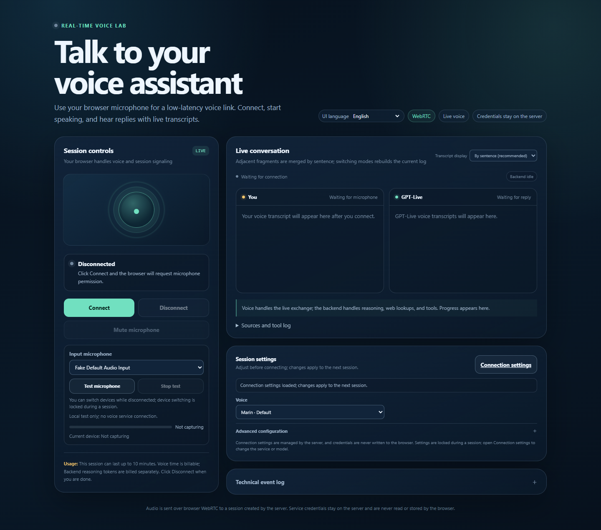

# GPT Live 1 Demo

English | [简体中文](README.zh-CN.md)

A self-hosted browser demo for a realtime voice assistant. The browser handles microphone input, playback, WebRTC, and timestamped transcript lines. The local Node.js service keeps credentials on the server, opens the live voice session, and can call an optional Responses-compatible reasoning backend.

This is an unofficial example application. It expects a live voice deployment that supports the `/live/sessions` protocol. A normal chat endpoint or an unrelated realtime API cannot be substituted without an adapter.

Project: <https://github.com/kylefu8/gpt-live-1-demo>



*English interface. Switch between English and Simplified Chinese from the selector at the top.*

## Try it as an end user

The easiest path on Windows is the published Windows x64 ZIP from [GitHub Releases](https://github.com/kylefu8/gpt-live-1-demo/releases/latest). The current public release is `v0.3.1`.

1. Download the complete ZIP and extract it to a new folder. Keep `Start.cmd`, `runtime`, and `app` together.
2. Double-click `Start.cmd`.
3. Allow microphone access when the browser asks.
4. In the setup wizard, enter the live voice service URL, deployment/model name, and API key, then run the connection test.
5. Optionally configure a Responses-compatible reasoning backend for calculations, weather, search, and complex questions. You can skip it and use voice conversation plus direct time/date answers.
6. Select a microphone, run the input and playback tests, choose a voice, and save.

The ZIP includes the official Node.js 24 Windows x64 runtime, so users do not need to install Node.js. Settings are written to the operating system's application data directory rather than back into the release folder.

Before starting, prepare:

- A live voice endpoint, deployment/model name, and API key.
- Optionally, a Responses-compatible endpoint, model name, and API key.
- A browser that supports microphone access and WebRTC. Chrome and Edge are recommended.
- HTTPS when the service is reached from another machine.

Use the **UI language** selector at the top of either page to switch between English and Simplified Chinese. The choice is remembered in your browser; switching does not reload the page or change the conversation language.

## What the demo does

- Uses the live voice model for speech, interruption handling, audio playback, and transcript events.
- Adds a timestamp and a new line for each displayed transcript sentence.
- Answers standalone current time, date, and weekday questions from the configured local clock without using the reasoning backend.
- Sends calculations, weather, web search, and broader reasoning to the configured backend. If no backend is configured, the setup page states that those capabilities are unavailable.
- Lets the user choose a voice, conversation language (Simplified Chinese, English, or automatic), timezone, default city, search option, reasoning effort, output budget, and session limit.
- Provides connection tests, microphone selection, an input level test, playback test tone, mute, reconnect, and session cleanup.

Changing a voice or other session setting takes effect on the next connection. A live session that is already connected keeps its current session configuration.

## Local development

For ongoing development, see the [development guide](docs/DEVELOPMENT.md) and [proposed roadmap](docs/ROADMAP.md).

Developers need Node.js 22 or newer:

```text
npm ci
npm start
```

`npm start` starts the local service and opens the browser. To start only the HTTP service:

```text
npm run start:server
```

Run the automated checks with:

```text
npm test
npm run check:release
```

Local mode binds to `127.0.0.1` by default. The browser setup wizard is the normal way to enter service settings. Advanced deployments can copy `.env.example` to `.env` and provide environment variables instead.

## Docker

For a local container:

```text
docker compose -f compose.yml up --build
```

Open <http://127.0.0.1:8767/> and complete the setup wizard. The compose file stores application data in the `gpt-live-1-demo-data` volume.

For a server, use `compose.remote.yml` with a server-only `.env` containing at least:

```dotenv
APP_MODE=remote
HOST=0.0.0.0
PUBLIC_ORIGIN=https://voice.example.com
SETUP_TOKEN=replace-with-a-long-random-value
APP_DATA_DIR=/data
```

Remote mode requires an HTTPS `PUBLIC_ORIGIN` and a reverse proxy that terminates TLS. Forward HTTP and WebSocket upgrades to the container's port `8767`. Protect the setup page with the generated or manually supplied setup token, then create an administrator password during the first setup. See [docs/DEPLOYMENT.md](docs/DEPLOYMENT.md).

## Render template

[](https://render.com/deploy?repo=https://github.com/kylefu8/gpt-live-1-demo)

The repository includes `render.yaml` for a Docker web service and a `/data` persistent disk. The template uses Render's paid Starter service and a persistent disk; check the price shown by Render before creating the service.

The template is a deployment starting point, not a hosted service. This repository does not claim that the Render template has been live deployed. After deployment, verify the generated HTTPS address, health endpoint, setup token, persistent storage, and microphone access yourself.

## Automatic web search

The assistant uses the reasoning service's native Responses API web_search tool when a question needs current information. It reuses the existing service address and API key: there is no separate search provider or search credential. New configurations enable it by default.

You can turn **Automatic web lookup** off in advanced preferences. Existing saved choices are preserved when upgrading; enable the switch if an older configuration has it off. Save and reconnect to apply the change. Sources appear under **Sources and tool log**.

For troubleshooting, **Test web lookup** checks for a completed native search and source links. The configured model deployment must support the tool and its administrator must allow access. Azure's native search uses Bing grounding; its current API does not support live page fetching and treats external_web_access as false. [Foundry native web search documentation](https://learn.microsoft.com/en-us/azure/foundry/openai/how-to/web-search).

## Configuration

Most users can leave `.env.example` alone and use the browser wizard. The variables below are available for automation and server deployments:

- `LIVE_PROVIDER`, `LIVE_BASE_URL`, `LIVE_API_KEY`, `LIVE_MODEL`: live voice service.
- `REASONING_BASE_URL`, `REASONING_API_KEY`, `REASONING_MODEL`, `REASONING_AUTH`: optional Responses-compatible backend.
- `APP_MODE`, `HOST`, `PORT`, `APP_DATA_DIR`: runtime mode and data location.
- `PUBLIC_ORIGIN`, `SETUP_TOKEN`: required protections for a remote deployment.

The server never sends a complete API key to the browser. Saved settings are kept in `settings.json` under the application data directory. The key is stored as plain text in that private file so the service can use it; the file is created with mode `0600` where the platform enforces POSIX modes. On Windows, protect the application data directory with the user account's filesystem permissions and keep backups private.

Do not commit `.env`, settings files, logs, screenshots, audio, or test output. Run `npm run check:release` before publishing.

## Costs and limits

The live voice service, optional reasoning backend, search service, and Render hosting are separate services. Their network traffic and usage charges belong to the account configured by the person deploying this project. The repository supplies no credentials and includes no shared hosted backend.

The direct time/date shortcut only handles standalone clock questions. Other tools still require the optional reasoning backend. Browser microphone permissions, HTTPS requirements, provider quotas, model compatibility, network quality, and audio autoplay policies can affect the experience.

## Release and privacy

The release builder uses an allowlist. It packages the application and required production dependencies, downloads a fixed official Node.js 24 runtime, verifies the published SHA-256, and writes `Start.cmd`. It does not copy local settings, logs, tests, or working directories. Release instructions are in [docs/RELEASE.md](docs/RELEASE.md).

The GitHub Actions checks run the test suite on Node.js 22 and 24, scan for private paths and likely credentials, build the Docker image, and smoke-test an empty local container. A successful CI run does not mean that a provider account or a Render deployment has been tested.

## License

MIT. See [LICENSE](LICENSE).
