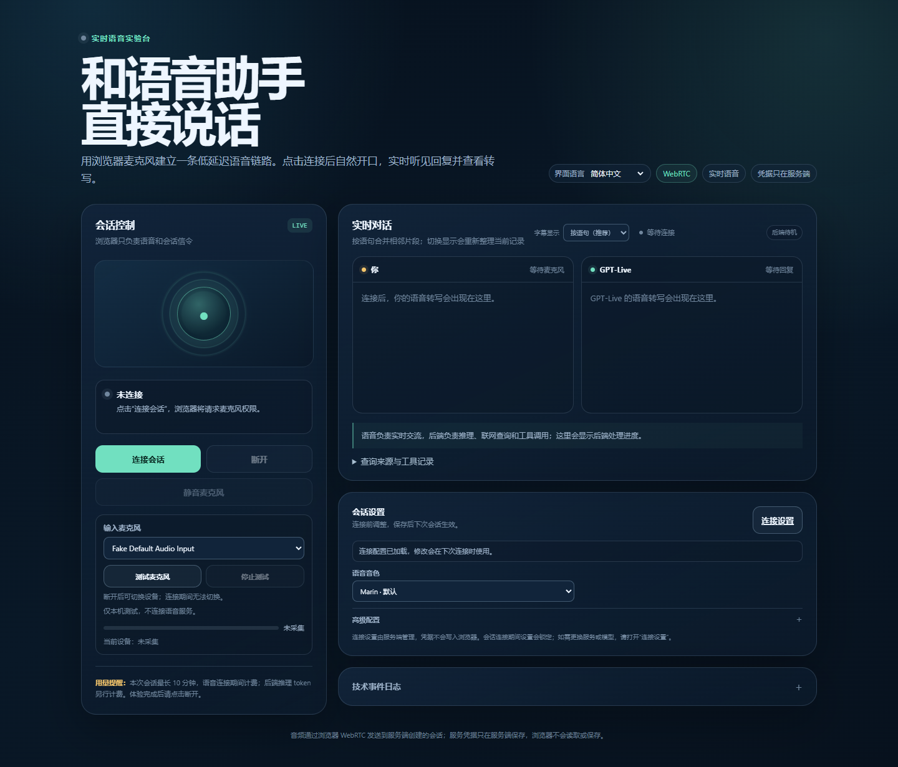

# GPT Live 1 Demo

[English](README.md) | 简体中文

这是一个可自行部署的浏览器实时语音助手示例。浏览器负责麦克风输入、播放、WebRTC 和带时间戳的转写行；本机 Node.js 服务负责保留凭据、建立实时语音会话，并可选调用兼容 Responses API 的推理后端。

这是非官方示例项目，需要一个支持 `/live/sessions` 协议的实时语音部署。普通聊天接口或其他不兼容的实时接口不能直接替代，除非另外提供适配器。

项目地址：<https://github.com/kylefu8/gpt-live-1-demo>



*中文界面，可通过顶部选择器切换中文和 English。*

## 普通用户最快开始

Windows 用户最省事的方式是从 [GitHub Releases](https://github.com/kylefu8/gpt-live-1-demo/releases/latest) 下载 Windows x64 ZIP。当前公开版本是 `v0.2.0`。

1. 下载完整 ZIP 并解压到新文件夹。请让 `Start.cmd`、`runtime` 和 `app` 保持在同一层级。
2. 双击 `Start.cmd`。
3. 浏览器请求时允许麦克风权限。
4. 在配置向导中填写实时语音服务地址、部署名或模型名和 API Key，然后测试连接。
5. 如果需要计算、天气、搜索和复杂问答，再配置一个兼容 Responses API 的推理后端。也可以先跳过，只体验语音对话和直接的时间/日期回答。
6. 选择麦克风，运行输入和播放测试，选择音色并保存。

ZIP 已包含官方 Node.js 24 Windows x64 运行时，用户不需要另行安装 Node.js。运行设置保存在操作系统的应用数据目录中，不会写回发行包目录。

开始前请准备：

- 一个可用的实时语音服务地址、部署名或模型名以及 API Key。
- 可选的兼容 Responses API 的服务地址、模型名以及 API Key。
- 支持麦克风和 WebRTC 的浏览器，推荐最新版 Chrome 或 Edge。
- 从其他设备访问服务器时使用 HTTPS。

使用两个页面顶部的**界面语言**选择器切换中文和 English。浏览器会记住选择；切换时不刷新页面，也不改变对话语言。

## 功能范围

- 使用实时语音模型处理听说、用户插话、语音播放和转写事件。
- 每条显示的转写句子带时间戳并换行。
- 独立的当前时间、日期和星期问题直接读取配置时区的本机时钟，不调用推理后端。
- 计算、天气、联网搜索和更广泛的推理交给已配置的后端。没有配置后端时，设置页会说明这些能力不可用。
- 可选择音色、对话语言（中文、English 或自动识别）、时区、默认城市、联网搜索、推理强度、输出预算和会话时长。
- 提供连接测试、麦克风选择、输入音量测试、播放测试音、静音、重新连接和会话清理。

更换音色或其他会话设置后，需要在下一次连接时生效；已经建立的实时会话会继续使用连接时的配置。

## 本地开发

开发者需要 Node.js 22 或更高版本：

```text
npm ci
npm start
```

`npm start` 会启动本机服务并打开浏览器。只启动 HTTP 服务时运行：

```text
npm run start:server
```

运行自动检查：

```text
npm test
npm run check:release
```

本机模式默认监听 `127.0.0.1`。通常应通过浏览器配置向导填写服务设置；自动化或高级部署也可以复制 `.env.example` 为 `.env`，再填写环境变量。

## Docker

本机容器运行：

```text
docker compose -f compose.yml up --build
```

打开 <http://127.0.0.1:8767/> 并完成配置向导。Compose 会把应用数据保存到 `gpt-live-1-demo-data` 数据卷。

服务器使用 `compose.remote.yml` 时，请准备只保存在服务器上的 `.env`，至少包含：

```dotenv
APP_MODE=remote
HOST=0.0.0.0
PUBLIC_ORIGIN=https://voice.example.com
SETUP_TOKEN=replace-with-a-long-random-value
APP_DATA_DIR=/data
```

服务器模式要求 `PUBLIC_ORIGIN` 使用 HTTPS，并由反向代理终止 TLS。将 HTTP 和 WebSocket 升级请求转发到容器的 `8767` 端口。使用生成的或手动设置的初始化口令保护设置页，并在首次设置时创建管理员密码。详见 [docs/DEPLOYMENT.zh-CN.md](docs/DEPLOYMENT.zh-CN.md)。

## Render 模板

[](https://render.com/deploy?repo=https://github.com/kylefu8/gpt-live-1-demo)

仓库包含 `render.yaml`，用于创建 Docker Web 服务和 `/data` 持久磁盘。模板使用 Render 的付费 Starter 服务和持久磁盘；创建服务前请以 Render 页面显示的价格为准。

模板只是部署起点，不是已经运行的托管服务。本仓库不声称 Render 模板已经完成线上部署。部署后请自行确认生成的 HTTPS 地址、健康检查、初始化口令、持久存储和浏览器麦克风访问。

## 配置

大多数用户可以保持 `.env.example` 不变，直接使用浏览器向导。自动化和服务器部署可以使用以下变量：

- `LIVE_PROVIDER`、`LIVE_BASE_URL`、`LIVE_API_KEY`、`LIVE_MODEL`：实时语音服务。
- `REASONING_BASE_URL`、`REASONING_API_KEY`、`REASONING_MODEL`、`REASONING_AUTH`：可选的兼容 Responses API 的推理后端。
- `APP_MODE`、`HOST`、`PORT`、`APP_DATA_DIR`：运行模式和数据位置。
- `PUBLIC_ORIGIN`、`SETUP_TOKEN`：服务器部署需要的来源校验和初始化保护。

服务端不会把完整 API Key 返回给浏览器。设置保存在应用数据目录下的 `settings.json` 中。为了让服务能够使用，Key 会以明文保存在这个私有文件中；在执行 POSIX 权限的平台上，文件会以 `0600` 模式创建。Windows 用户应使用账户文件系统权限保护应用数据目录，并让备份保持私密。

不要把 `.env`、设置文件、日志、截图、音频或测试输出提交到 Git。发布前运行 `npm run check:release`。

## 费用和限制

实时语音服务、可选推理后端、搜索服务和 Render 托管是相互独立的服务。网络流量和使用费用由部署者配置的账户承担。本仓库不提供凭据，也不包含共享的在线后端。

直接读取时间/日期的快捷路径只处理独立的时钟问题。其他工具仍需要配置推理后端。浏览器麦克风权限、HTTPS 要求、服务额度、模型兼容性、网络质量和浏览器自动播放策略都会影响使用体验。

## 发布和隐私

发行构建脚本使用明确的文件白名单：打包应用和必要的生产依赖，下载固定版本的官方 Node.js 24 运行时，校验官方 SHA-256，然后写入 `Start.cmd`。它不会复制本机设置、日志、测试或工作目录。发布步骤见 [docs/RELEASE.zh-CN.md](docs/RELEASE.zh-CN.md)。

GitHub Actions 会在 Node.js 22 和 24 上运行测试，扫描本机路径和疑似凭据，构建 Docker 镜像，并启动空配置的本机容器做健康检查。CI 通过不代表某个服务账户或 Render 部署已经完成验证。

## 许可证

MIT，见 [LICENSE](LICENSE)。
